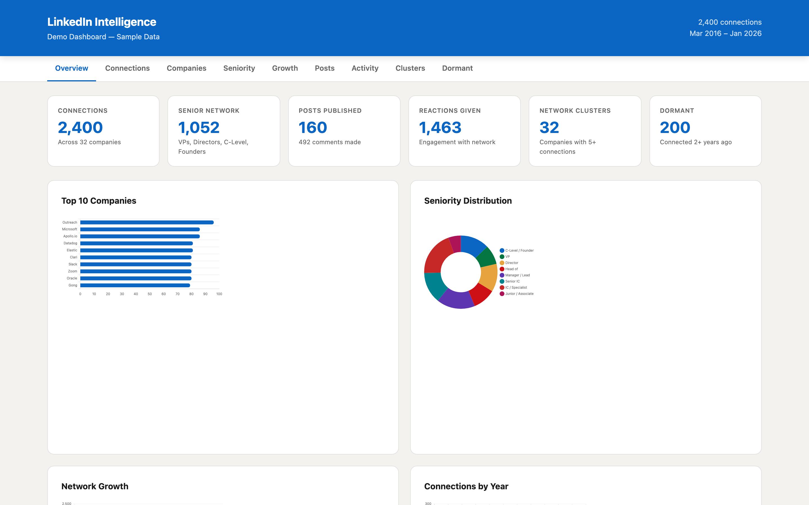
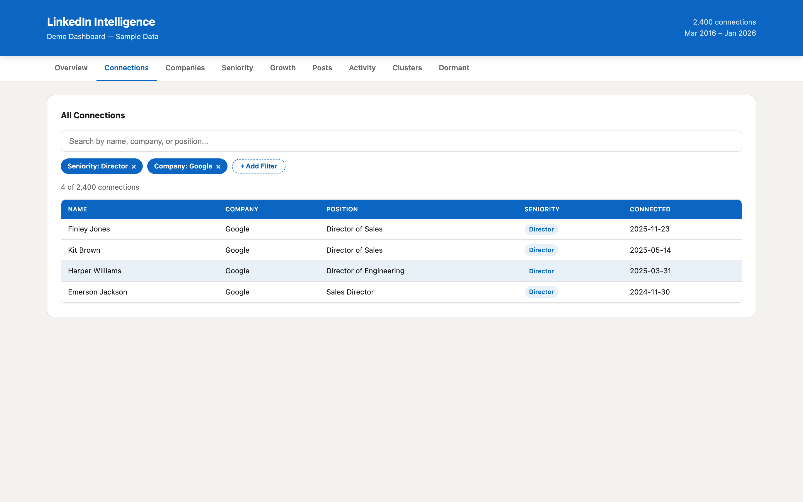
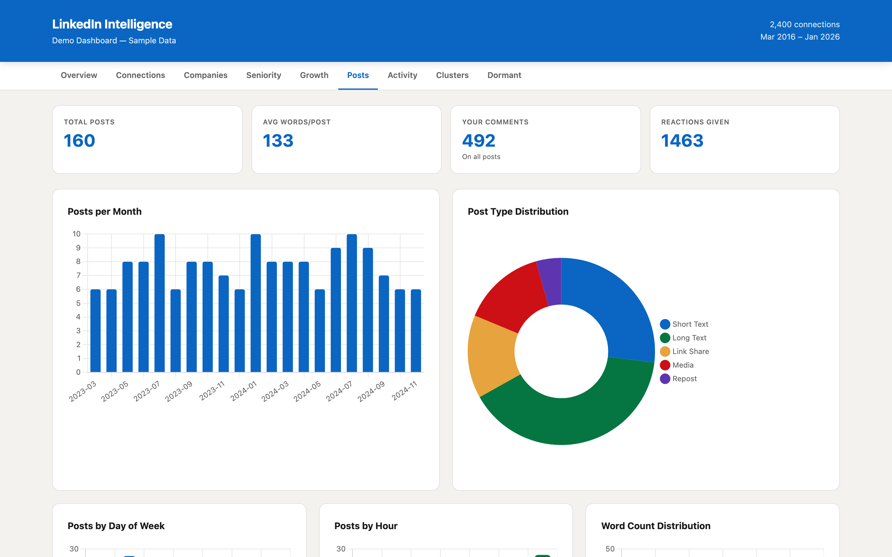
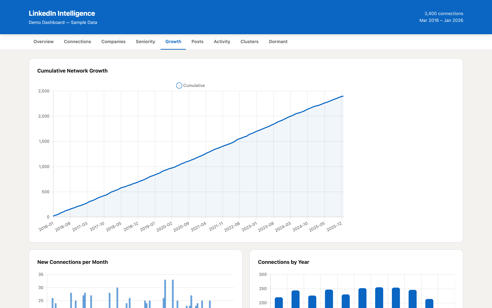
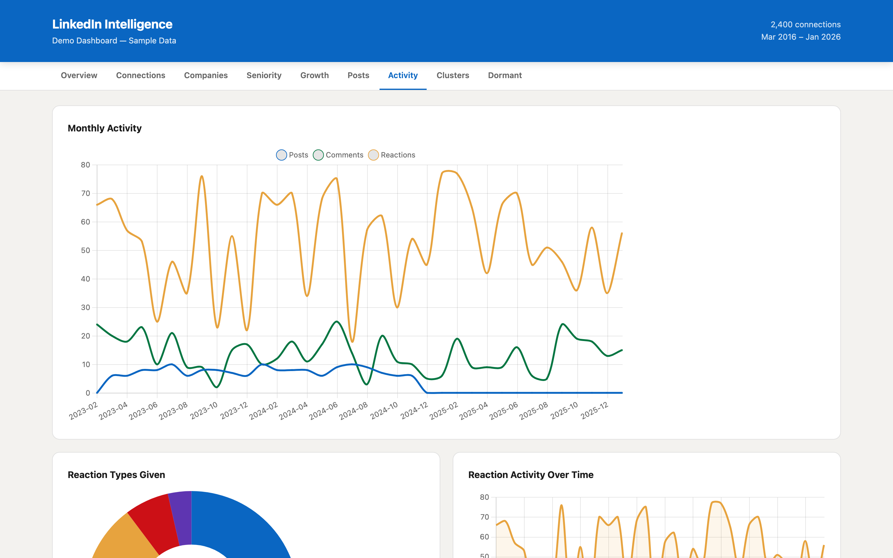
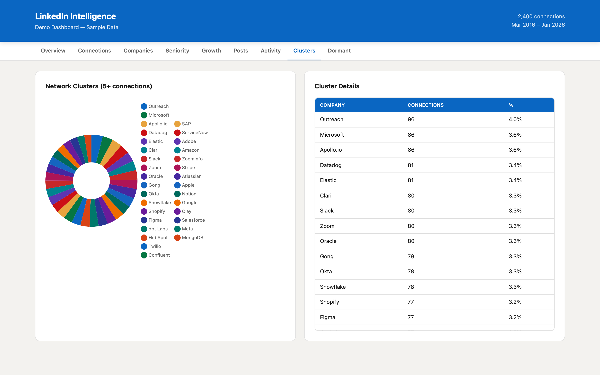
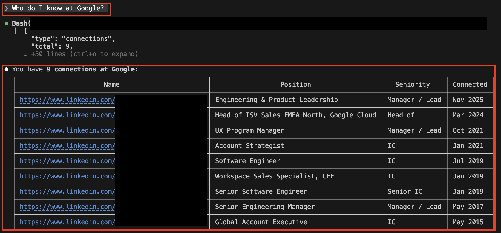

# LinkedIn Intelligence

Turn your LinkedIn data export into an interactive browser dashboard. Analyze your connections, content, activity patterns, and network clusters — entirely offline.



## Features

**Connections** — Browse all your connections with a stackable multi-filter system. Filter by seniority level, company, connection year, or position keywords. Add multiple filters, remove any with one click.



**Post Analysis** — Every post you've published with content preview, type classification (Long Text, Short Text, Media, Link Share, Repost), word count analysis, day/hour patterns, and direct links to the original.



**Network Growth** — Track how your network has grown over time with cumulative and monthly views.



**Activity Patterns** — Track your posting, commenting, and reaction activity over time. See which reaction types you use most.



**Network Clusters** — Identify companies where your network is concentrated.



**Natural Language Queries** — Ask questions about your data in plain English. "Who do I know at Google?", "Summarize my posts about AI", "Show me VP-level connections" — powered by Claude.



## Quick Start

### 1. Export your LinkedIn data

Go to [linkedin.com/mypreferences/d/download-my-data](https://www.linkedin.com/mypreferences/d/download-my-data), request an archive (all data or at minimum: Connections, Shares, Comments, Reactions), and download when ready.

### 2. Install dependencies

```bash
pip install pandas openpyxl
```

### 3. Place your export

Copy the extracted LinkedIn export folder into this directory. The script auto-detects any folder named `Complete_LinkedInDataExport_*`.

### 4. Generate the dashboard

```bash
python build_dashboard.py
open dashboard.html
```

That's it. One HTML file, no server needed.

### 5. Query your data (optional)

Use the CLI to query your LinkedIn data directly:

```bash
# Overview stats
python query_linkedin.py --type summary

# Find connections at a company
python query_linkedin.py --type connections --company "Google"

# Filter by seniority
python query_linkedin.py --type connections --seniority "VP" --seniority "Director"

# Search posts by topic
python query_linkedin.py --type posts --search "AI"

# Recent connections (last 90 days)
python query_linkedin.py --type connections --recent 90
```

Or just ask Claude in natural language — the skill handles the rest.

## Dashboard Tabs

| Tab | What's Inside |
|---|---|
| **Overview** | Key stats + 4 summary charts |
| **Connections** | All connections with search + stackable filters |
| **Companies** | Top 20 companies in your network |
| **Seniority** | Network breakdown by seniority level |
| **Growth** | Connection growth over time |
| **Posts** | Deep post analysis with 5 charts + content feed |
| **Activity** | Posting/commenting/reaction patterns |
| **Clusters** | Companies with 5+ connections |
| **Dormant** | Connections older than 2 years |

## Filter System

On the Connections tab, click **+ Add Filter** to open the filter builder:

- **Seniority** — C-Level / Founder, VP, Director, Head of, Manager / Lead, Senior IC, IC / Specialist
- **Company** — Select from your top 100 companies
- **Connection Year** — Filter by when you connected
- **Position Contains** — Free text match (e.g., "Engineer", "Sales")

Filters stack: add as many as you need. Each shows as a removable tag. All filters must match (AND logic).

## Natural Language Queries

With the Claude Code skill active, just ask questions about your data:

```
"Who do I know at Google?"
"Show me all VPs and Directors in my network"
"Summarize my posts about RevOps"
"How many connections did I make in 2025?"
"Find founders I'm connected with"
"What are the top companies in my network?"
"Show me my recent posts about AI"
```

Claude runs `query_linkedin.py` with the right filters, parses the results, and answers conversationally — including follow-up questions.

### Query CLI Reference

| Flag | Description |
|---|---|
| `--type` | `summary`, `connections`, `posts`, `comments`, `reactions` |
| `--company` | Filter by company name (partial match) |
| `--seniority` | Filter by level (repeatable for multiple) |
| `--position` | Filter by position keyword |
| `--search` | Full-text search |
| `--year` | Filter by year |
| `--recent N` | Connections from last N days |
| `--post-type` | `Long Text`, `Short Text`, `Media`, `Link Share`, `Repost` |
| `--limit N` | Max results (default 500) |

## Privacy

Your data stays local. Nothing is sent to any server.

- The script reads your LinkedIn CSV files and generates a static HTML file
- The HTML contains your data as embedded JSON — **do not publish it**
- `.gitignore` is preconfigured to exclude all LinkedIn exports, CSVs, and generated files

**Before pushing to GitHub**, verify with `git status` — you should never see your personal data listed.

## Limitations

- **No likes/views/impressions**: LinkedIn's data export doesn't include engagement metrics on your posts. Only your content and outbound activity are exported.
- **Comment counts are partial**: Shows your own replies per post, not total comments from others.
- **Seniority detection is heuristic**: Based on keyword matching in job titles — may misclassify unusual titles.

## Tech Stack

- **Python 3.9+** with `pandas` for data processing
- **Chart.js 4.x** for interactive charts (loaded from CDN)
- Single self-contained HTML output — no build step, no framework, no server

## Project Structure

```
├── linkedin_data.py             # Shared data loading & processing module
├── build_dashboard.py           # Generates dashboard.html
├── query_linkedin.py            # CLI query tool for natural language queries
├── generate_mock_dashboard.py   # Generate demo dashboard with sample data
├── take_screenshots.py          # Capture dashboard screenshots
├── SKILL.md                     # Detailed skill documentation
├── README.md
├── .gitignore
├── screenshots/                 # Dashboard screenshots for README
└── examples/
    └── workflow_*.md
```

## License

MIT
